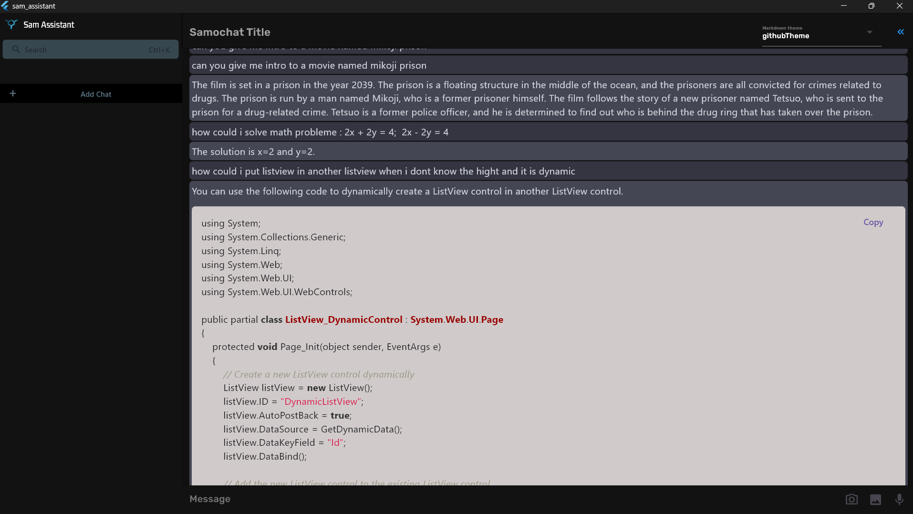

# Sam-assistant Frontend (Flutter)

This is the frontend for the Sam-assistant project, built with Flutter.

## Table of contents

-   [Overview](##Overview)
-   [Features](###Features)

**Note:** This project is in its early stages, and the code may undergo drastic changes.

## Overview

Sam-assistant is a personal assistant that can understand your documents, search the internet, and in future versions, create and understand images, and communicate with you. The frontend for Sam-assistant is built using Flutter, a popular open-source UI toolkit for building natively compiled applications for mobile, web, and desktop.

### Features

The Sam-assistant frontend includes the following key features:

-   Text-based communication with the personal assistant
-   Displaying results from internet search queries
-   Interpreting and displaying document understanding results
-   Vector database management

## Getting Started

To get started with Sam-assistant frontend, follow these steps:

1.  Clone the repository to your local machine
    
2.  Open the project in your preferred IDE
    
3.  Run the following command to install the required packages:
    
    arduinoCopy code
    
    `flutter pub get`
    
4.  Run the application using the following command:
    
    arduinoCopy code
    
    `flutter run`
    
5.  The application should launch and display the chat interface. You can start communicating with your personal assistant.
    

## Usage

The frontend for Sam-assistant provides a chat interface where you can type in your queries and receive responses from the personal assistant. You can ask the personal assistant to perform tasks such as internet search queries and document understanding.

## Tags

Some tags that could be added to this project are:

-   Personal assistant
-   Flutter
-   Chatbot
-   Embeddings
-   Vector DB

## Conclusion

The Sam-assistant frontend is built using Flutter, making it easy to deploy on multiple platforms, including mobile, web, and desktop. The chat interface allows for easy communication with the personal assistant, and the application can perform various tasks, including internet search and document understanding. The project is a work in progress, and more features will be added in the future.